<!--
Concept map for IEEE P3109/D1 (July 2026) draft.
Source document: IEEE_D1.md (2948 lines).  Section index: IEEE_D1.json
Every concept node carries a link of the form IEEE_D1.md#L<line> back to the draft.
Normative = clauses 1..5.  Informative = Annexes A..H.
-->

# IEEE P3109/D1 — Concept Map

Concept map of the whole draft **Arithmetic Formats for Machine Learning**
(IEEE P3109/D1, July 2026), source [IEEE_D1.md](IEEE_D1.md), section index
[IEEE_D1.json](IEEE_D1.json).

> **Scope.** This is a map of the external D1 specification, not a map of the
> SmallFloats.jl source tree. It is intentionally stable with the D1 snapshot.
> The implementation-facing chain is [extendingK.md](extendingK.md) for design
> decisions, [doingtheextensions.md](doingtheextensions.md) for the resulting
> architecture, and [implementextensions.md](implementextensions.md) for the
> executed stages and conformance gates. Current code remains the authority when
> an implementation record and a source file differ.

## 0. How to read

- Nodes are **concepts** (types, parameters, functions, modes, artifacts).
- Edges are **labeled relations**, not control flow. Relation vocabulary:

| Relation | Meaning |
| --- | --- |
| `parameterizes` | left is a defining parameter of right |
| `derives` | right is computed from left by a fixed formula |
| `member-of` | left is an element of the set/enumeration right |
| `maps-to` | left is a function whose codomain is right |
| `composed-of` | right is built by composing left |
| `constrains` | left restricts the admissible values of right |
| `classifies` | left is a predicate/partition over right |
| `justifies` | informative rationale for a normative choice |
| `requires` | conformance obligation |
| `approximates` | left is a declared-inexact stand-in for right |

- **N** = normative clause, **I** = informative annex.
- Diagrams are split by layer; §1 is the master map tying the layers together.

---

## 1. Master map

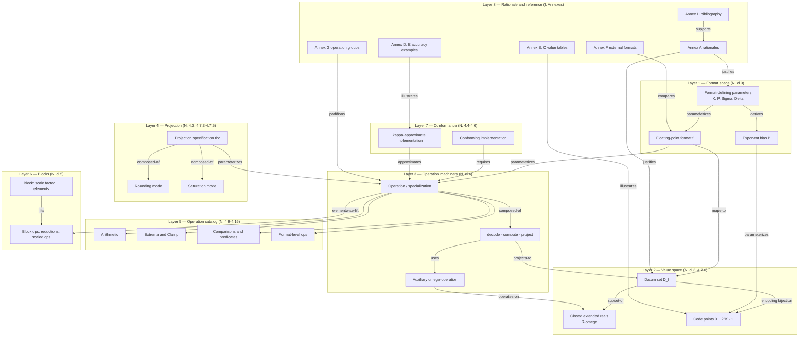

---

## 2. Layer 1 — Format space (N)

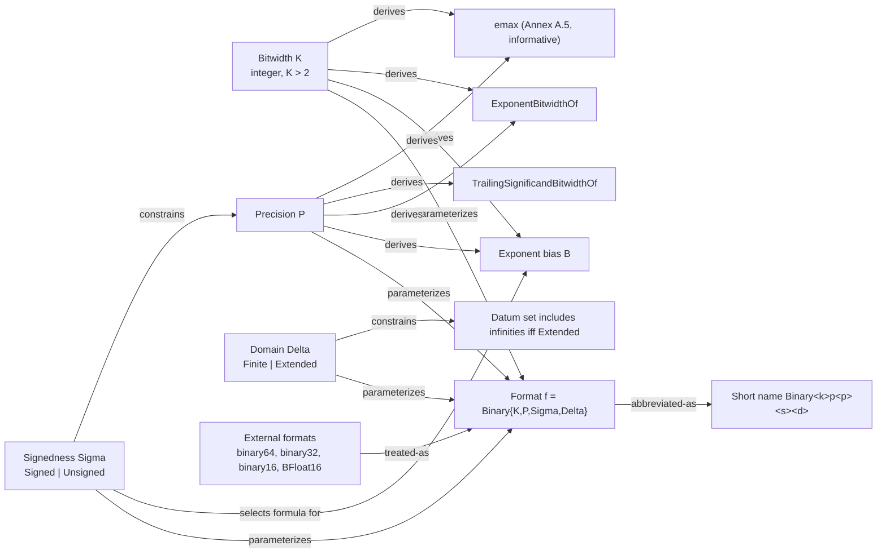

**Constraints and formulas** ([§3.1](IEEE_D1.md#L264), [§4.14](IEEE_D1.md#L1975), [Annex A.5](IEEE_D1.md#L2503)):

| Quantity | Signed | Unsigned |
| --- | --- | --- |
| Precision range | `0 < P < K` | `0 < P <= K` |
| Exponent bias `B` | `2^(K-P-1)` | `2^(K-P)` |
| `ExponentBitwidthOf(f)` | `K - P` | `K - P + 1` |
| `TrailingSignificandBitwidthOf(f)` | `P - 1` | `P - 1` |

`emax` (informative, [Annex A.5](IEEE_D1.md#L2503)):

```
emax = 2^(K-1) - 3    if P = 1, Unsigned, Extended
     = 2^(K-1) - 2    if P = 1, Unsigned, Finite
     = 2^(K-2) - 2    if P = 1, Signed,   Extended
     = 2^(K-2) - 2    if P = 2, Unsigned, Extended
     = 2^(K-P-1) - 1  otherwise if Signed
     = 2^(K-P) - 1    otherwise if Unsigned
```

---

## 3. Layer 2 — Value space, datums, encoding (N)

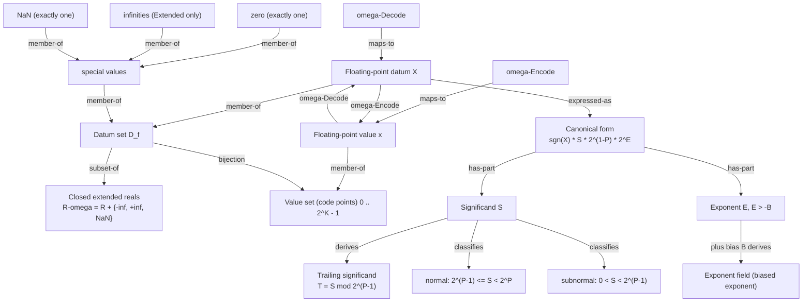

**Special code points** ([Annex B](IEEE_D1.md#L2536), Table 3):

| Datum | Signed extended | Signed finite | Unsigned extended | Unsigned finite |
| --- | --- | --- | --- | --- |
| Zero | `0` | `0` | `0` | `0` |
| One | `2^(K-2)` | `2^(K-2)` | `2^(K-1)` | `2^(K-1)` |
| NaN | `2^(K-1)` | `2^(K-1)` | `2^K - 1` | `2^K - 1` |
| `+Inf` | `2^(K-1) - 1` | — | `2^K - 2` | — |
| `-Inf` | `2^K - 1` | — | — | — |

Zero is unique (no `-0`); NaN is unique and occupies the IEEE-754 `-0`
code point in signed formats.

---

## 4. Layer 3 — Operation machinery (N, [§4](IEEE_D1.md#L330))

The single most load-bearing structure in the document: **every numeric
operation is decode, then exact computation over `R-omega`, then projection.**

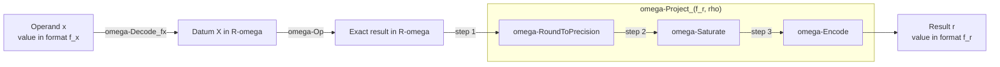

Canonical law ([§4.3.2](IEEE_D1.md#L405), applied throughout §4.9–§4.11):

```
Op_{f_x, f_y, f_r, rho}(x, y)
    = omega-Project_{f_r, rho}( omega-Op( omega-Decode_{f_x}(x),
                                          omega-Decode_{f_y}(y) ) )
```

Exceptions to the law: comparisons and predicates return Booleans and stop
after `omega-Decode` ([§4.12](IEEE_D1.md#L1778), [§4.13](IEEE_D1.md#L1895));
`NextGreaterThan` / `NextLessThan` work directly on code points
([§4.16](IEEE_D1.md#L2027)); format-level operations take a format, not a value
([§4.14](IEEE_D1.md#L1975)).

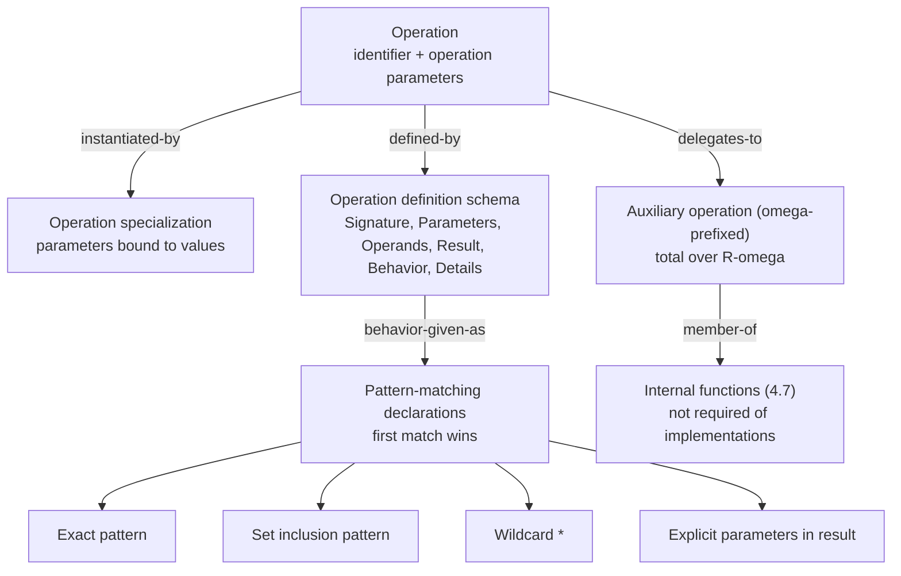

Internal functions ([§4.7](IEEE_D1.md#L613)): `omega-Decode` / `omega-DecodeAux`,
`omega-Project`, `omega-RoundToPrecision`, `omega-Saturate`, `omega-Encode`;
plus external-format bridges `omega-DecodeExternal` / `omega-EncodeExternal`
([§4.8](IEEE_D1.md#L865)).

---

## 5. Layer 4 — Projection: rounding and saturation (N)

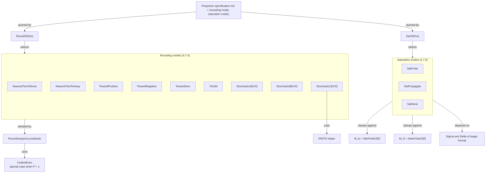

Ordering fact that the whole clause turns on ([§4.7.3](IEEE_D1.md#L665) NOTE 1,
[§4.7.5](IEEE_D1.md#L770) NOTE): **rounding precedes saturation**, yet the
rounding mode is *also* passed to `omega-Saturate` so that a directed rounding
mode can force a finite result. Saturation itself never rounds.

Saturation semantics summary:

| Mode | Out-of-range finite | `+/-inf` input |
| --- | --- | --- |
| `SatFinite` | clamp to `M_lo` / `M_hi` | clamp to `M_lo` / `M_hi` |
| `SatPropagate` | clamp to `M_lo` / `M_hi` | preserved if representable, else clamped |
| `SatNone` | to `+/-inf` (Extended) or NaN, per rounding direction, signedness, domain | preserved if representable, else NaN |

Stochastic rounding takes `N` random bits as unsigned `R`, `0 <= R < 2^N`;
bit quality is explicitly unspecified ([§4.7.4](IEEE_D1.md#L704) Details).

---

## 6. Layer 5 — Operation catalog (N, [§4.9](IEEE_D1.md#L917)–[§4.16](IEEE_D1.md#L2027))

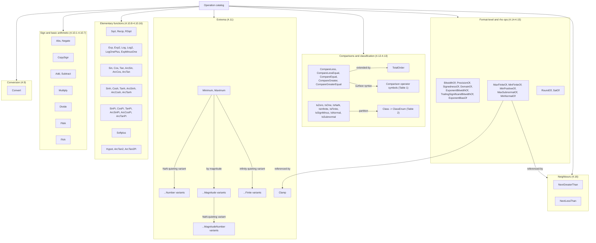

**Class enumeration** ([§4.13.1](IEEE_D1.md#L1944), Table 2), eight disjoint
classes: `ClsNaN`, `ClsNegativeInfinity`, `ClsNegativeNormal`,
`ClsNegativeSubnormal`, `ClsZero`, `ClsPositiveSubnormal`,
`ClsPositiveNormal`, `ClsPositiveInfinity`.

**Design decisions visible only in the pattern tables:**

| Case | Result | Where |
| --- | --- | --- |
| `Divide(x, 0)` | `NaN` (not `Inf`) | [§4.10.5](IEEE_D1.md#L1093) NOTE 2 |
| `Divide(x, +/-Inf)` | `0` | [§4.10.5](IEEE_D1.md#L1093) NOTE 1 |
| `Recip(+/-inf)` | `0`, and `Recip(0) = NaN` | [§4.10.8](IEEE_D1.md#L1232) |
| `ArcTan2(0, 0)` | `NaN` (limit indeterminate) | [§4.10.15](IEEE_D1.md#L1518) |
| `TotalOrder(NaN, x)` | `True` — NaN is most negative | [§4.12.1](IEEE_D1.md#L1851) |
| `NextGreaterThan(Inf)` | `NaN`, unlike IEEE-754 `nextUp` | [§4.16](IEEE_D1.md#L2027) NOTE 2 |
| `omega-FMA(X,Y,Z)` | equivalent to `omega-Add(omega-Multiply(X,Y), Z)` | [§4.10.6](IEEE_D1.md#L1131) |
| `omega-FAA` | associative: `Add(Add(X,Y),Z) = Add(X,Add(Y,Z))` | [§4.10.7](IEEE_D1.md#L1182) |

---

## 7. Layer 6 — Blocks and scaled operations (N, [§5](IEEE_D1.md#L2077))

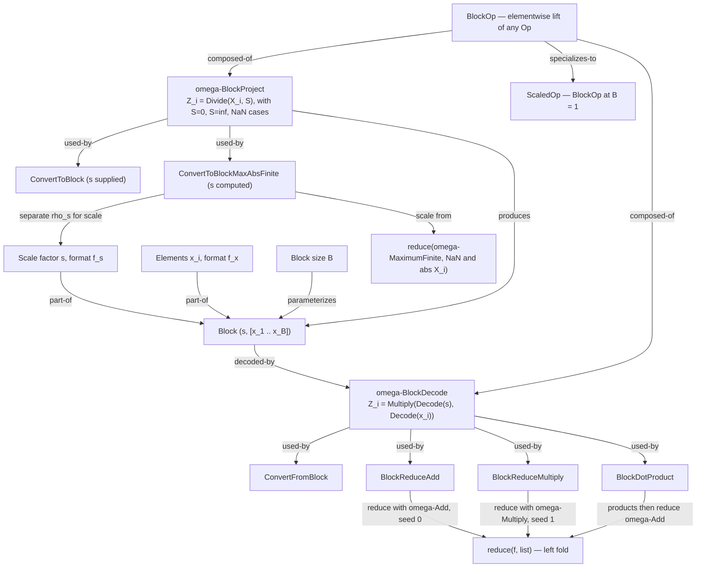

Key block facts:

- `omega-BlockDecode` **multiplies** by the scale; `omega-BlockProject`
  **divides** by it ([§5.1](IEEE_D1.md#L2089)).
- Scale-factor edge cases in `omega-BlockProject`: `S` NaN or `X_i` NaN gives
  NaN; `S = 0` gives `0`; `S = +/-inf` gives `sgn(X_i) * sgn(S)`.
- `ConvertToBlockMaxAbsFinite` carries **two** projection specifications:
  `rho_s` for the scale factor, `rho` for the elements
  ([§5.2.3](IEEE_D1.md#L2200)).
- `BlockOp` result scale factor `s_r` is an **input operand**, not computed
  ([§5.4](IEEE_D1.md#L2310)).
- Valid `Op` substitutions in `BlockOp`: 30 unary, 18 binary, 3 ternary
  (`FMA`, `FAA`, `Clamp`).
- Scaled operations are exactly `B = 1` block operations
  ([§5.5](IEEE_D1.md#L2357)); a scale format with `P = 1` restricts scales to
  powers of two.

---

## 8. Layer 7 — Conformance and approximation (N, [§4.4](IEEE_D1.md#L468)–[§4.6](IEEE_D1.md#L588))

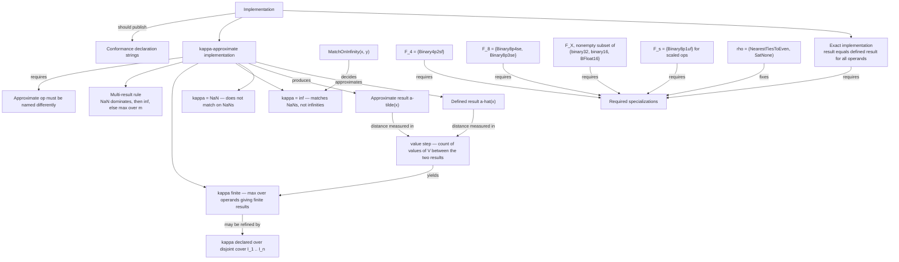

`kappa` ladder, in decision order ([§4.4](IEEE_D1.md#L468)):

1. NaN behavior differs anywhere → declare `kappa = NaN`.
2. Else infinity behavior differs anywhere (`MatchOnInfinity` false) → `kappa = inf`.
3. Else `kappa = max over x in I of #(((a-hat(x), a-tilde(x)] union [a-tilde(x), a-hat(x))) intersect V)`.

Required specializations ([§4.5](IEEE_D1.md#L521)): `Convert`, `Negate`, `Abs`,
`Recip`, `Add`, `Subtract`, `Multiply`, `FMA`, `FAA`, the ten min/max variants,
five comparisons, ten predicates and neighbour ops, twelve format-level ops,
and `ScaledAdd` / `ScaledSubtract` / `ScaledMultiply`.

---

## 9. Layer 8 — Interoperation with IEEE-754 and external formats

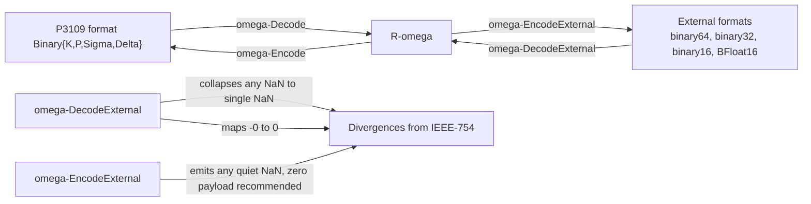

Divergences from IEEE Std 754-2019, collected:

| Aspect | IEEE-754 | P3109/D1 |
| --- | --- | --- |
| NaN count | many, with payloads | exactly one |
| Negative zero | present | absent |
| Infinities | always present | only in `Extended` domain |
| Exponent bias | from `emax` and interchange params | from `K`, `P`, `Sigma` |
| `1/0` | signed infinity | `NaN` |
| `nextUp(+inf)` | `+inf` | `NextGreaterThan(Inf) = NaN` |
| Saturation | not a format attribute | first-class `rho` component |

Annex F ([§Annex F](IEEE_D1.md#L2781)) compares against OCP (OFP8), AGQ
(AMD / Graphcore / Qualcomm), and TSL (Tesla Dojo) on: shared special values,
single NaN, negative zero, infinity presence, and `emax`.

---

## 10. Layer 9 — Rationale map (I, [Annex A](IEEE_D1.md#L2371))

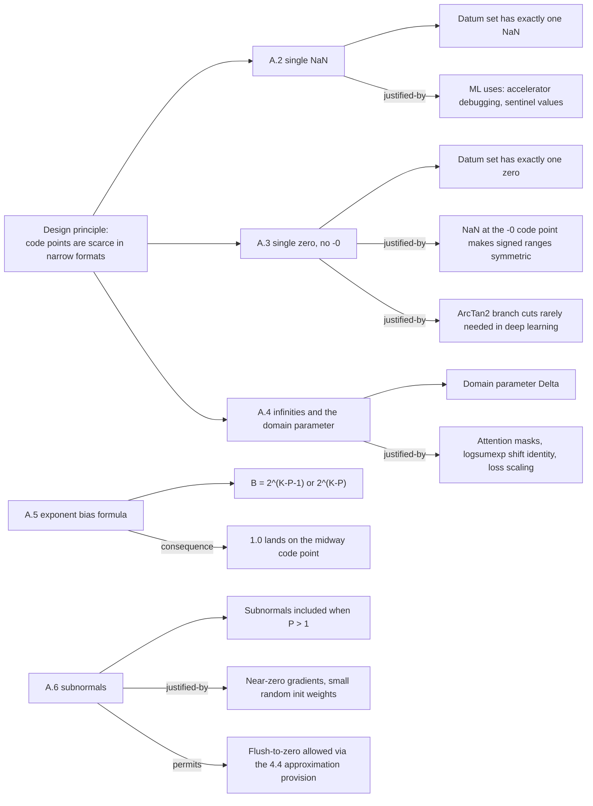

The `logsumexp` argument in [Annex A.4](IEEE_D1.md#L2427) is the strongest
rationale in the document: the shift identity
`logsumexp(v) = logsumexp(v - max(v)) + max(v)` needs the *stickiness* of `-inf`;
substituting `maxFinite` silently breaks it at small temperature `tau` or in
mixed precision.

---

## 11. Reference artifacts (I, Annexes B–H)

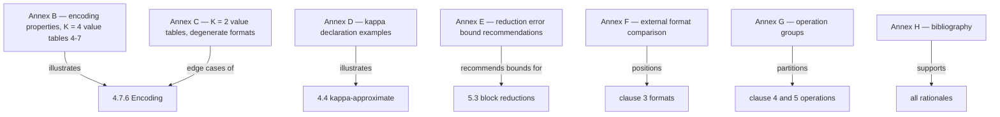

**Annex C degeneracies at `K = 2`** — worth knowing when writing generic code:

- `Binary2p1ue` and `Binary2p2ue` share a datum set (different subnormal split);
  likewise `Binary2p1uf` and `Binary2p2uf`.
- `1.0` is absent from `Binary2p1se`, `Binary2p1ue`, `Binary2p2ue`, so Table 3
  does not apply.
- `Binary2p1se` has no normal or subnormal values: `MinPositiveOf = Inf`.
- `Binary2p1se`, `Binary2p2ue` have no normals: `MinNormalOf(f) = NaN`.

**Annex G operation groups**: A (Core), B (Basic), C (Full), M (Meta),
KA (Block Core), KB (Block Basic), KC (Block Full), E (Block Reductions).

**Annex E error bounds** for `B = 8`, `Binary8p4se` in/out, `binary16`
accumulation, `NearestTiesToEven`:

| Operation | Bound |
| --- | --- |
| `BlockReduceAdd` | `abs(S - S~) <= abs(S)/16 + 3.637e-3 * sum(abs(X_i))` |
| `BlockReduceMultiply` | `abs(P - P~) <= abs(P) * 6.614e-2` |
| `BlockDotProduct` | `abs(D - D~) <= abs(D)/16 + 3.637e-3 * sum(abs(X_i * Y_i))` |

Constants derive from `11 = PrecisionOf(binary16)`, `7 = B - 1`, and
`16 = 2^PrecisionOf(Binary8p4se)`.

---

## 12. Concept inventory

Alphabetical, with kind, source, and status.

| Concept | Kind | Source | Status |
| --- | --- | --- | --- |
| approximate implementation | conformance | [§4.4](IEEE_D1.md#L468) | N |
| auxiliary operation (`omega-`) | function class | [§4.1](IEEE_D1.md#L332) | N |
| bitwidth `K` | parameter | [§2.1](IEEE_D1.md#L161), [§3.1](IEEE_D1.md#L264) | N |
| block | data structure | [§2.1](IEEE_D1.md#L161), [§5](IEEE_D1.md#L2077) | N |
| block size `B` | parameter | [§5](IEEE_D1.md#L2077) | N |
| canonical form | representation | [§2.1](IEEE_D1.md#L161), [§3.1](IEEE_D1.md#L264) | N |
| `Class` / `ClassEnum` | operation / enumeration | [§4.13.1](IEEE_D1.md#L1944) | N |
| closed extended reals `R-omega` | value domain | [§2.1](IEEE_D1.md#L161), [§3.1](IEEE_D1.md#L264) | N |
| code point | encoding | [§2.1](IEEE_D1.md#L161) | N |
| comparison predicate | operation class | [§4.12](IEEE_D1.md#L1778) | N |
| conformance declaration | artifact | [§4.6](IEEE_D1.md#L588) | N |
| conforming implementation | conformance | [§4.5](IEEE_D1.md#L521) | N |
| datum | value | [§2.1](IEEE_D1.md#L161) | N |
| datum set `D_f` | value domain | [§2.1](IEEE_D1.md#L161) | N |
| defined operation / defined result | conformance | [§2.1](IEEE_D1.md#L161), [§4.4](IEEE_D1.md#L468) | N |
| domain `Delta` | parameter | [§2.1](IEEE_D1.md#L161), [§3.1](IEEE_D1.md#L264) | N |
| encoding | mapping | [§2.1](IEEE_D1.md#L161), [§4.7.6](IEEE_D1.md#L818) | N |
| exponent `E` | component | [§2.1](IEEE_D1.md#L161) | N |
| exponent bias `B` | derived parameter | [§3.1](IEEE_D1.md#L264), [Annex A.5](IEEE_D1.md#L2503) | N + I |
| exponent field | encoding field | [§2.1](IEEE_D1.md#L161), [§4.7.2](IEEE_D1.md#L619) | N |
| external format | interop | [§4.8](IEEE_D1.md#L865), [Annex F](IEEE_D1.md#L2781) | N + I |
| `emax` | derived quantity | [Annex A.5](IEEE_D1.md#L2503) | I |
| finite (of datum / of value) | qualifier | [§3.1](IEEE_D1.md#L264) | N |
| format `f` | type | [§2.1](IEEE_D1.md#L161), [§3.1](IEEE_D1.md#L264) | N |
| format-defining parameters | parameter set | [§3.1](IEEE_D1.md#L264) | N |
| format naming | notation | [§3.2](IEEE_D1.md#L315) | N |
| format-level operation | operation class | [§4.14](IEEE_D1.md#L1975) | N |
| infinity | special value | [§3.1](IEEE_D1.md#L264), [Annex A.4](IEEE_D1.md#L2427) | N + I |
| internal function | function class | [§4.7](IEEE_D1.md#L613) | N |
| `kappa` (value steps) | accuracy measure | [§4.4](IEEE_D1.md#L468), [Annex D](IEEE_D1.md#L2672) | N + I |
| `MatchOnInfinity` | predicate | [§4.4](IEEE_D1.md#L468) | N |
| NaN | special value | [§2.1](IEEE_D1.md#L161), [Annex A.2](IEEE_D1.md#L2380) | N + I |
| normal | value class | [§2.1](IEEE_D1.md#L161), [§3.1](IEEE_D1.md#L264) | N |
| operand | term | [§2.1](IEEE_D1.md#L161) | N |
| operation | term | [§2.1](IEEE_D1.md#L161), [§4.1](IEEE_D1.md#L332) | N |
| operation definition schema | notation | [§4.3.1](IEEE_D1.md#L382) | N |
| operation group | taxonomy | [Annex G](IEEE_D1.md#L2805) | I |
| operation specialization | term | [§2.1](IEEE_D1.md#L161), [§4.1](IEEE_D1.md#L332) | N |
| pattern-matching declaration | notation | [§4.3.2](IEEE_D1.md#L405) | N |
| precision `P` | parameter | [§2.1](IEEE_D1.md#L161), [§3.1](IEEE_D1.md#L264) | N |
| projection specification `rho` | parameter | [§2.1](IEEE_D1.md#L161), [§4.2](IEEE_D1.md#L360) | N |
| `reduce` | helper | [§5](IEEE_D1.md#L2077) | N |
| rounded value | intermediate | [§2.1](IEEE_D1.md#L161), [§4.7.4](IEEE_D1.md#L704) | N |
| rounding mode | attribute | [§4.2](IEEE_D1.md#L360), [§4.7.4](IEEE_D1.md#L704) | N |
| saturation mode | attribute | [§4.2](IEEE_D1.md#L360), [§4.7.5](IEEE_D1.md#L770) | N |
| scale factor | block component | [§2.1](IEEE_D1.md#L161), [§5](IEEE_D1.md#L2077) | N |
| scaled operation | operation class | [§5.5](IEEE_D1.md#L2357) | N |
| significand `S` | component | [§2.1](IEEE_D1.md#L161) | N |
| signedness `Sigma` | parameter | [§2.1](IEEE_D1.md#L161), [§3.1](IEEE_D1.md#L264) | N |
| special value | value class | [§2.1](IEEE_D1.md#L161), [Annex B](IEEE_D1.md#L2536) | N + I |
| stochastic rounding A / B / C | rounding mode | [§4.7.4](IEEE_D1.md#L704) | N |
| subnormal | value class | [§2.1](IEEE_D1.md#L161), [Annex A.6](IEEE_D1.md#L2523) | N + I |
| total order | predicate | [§4.12.1](IEEE_D1.md#L1851) | N |
| trailing significand field | encoding field | [§2.1](IEEE_D1.md#L161) | N |
| value set | set | [§2.1](IEEE_D1.md#L161) | N |
| word usage: shall / should / may / can | convention | [§1.2](IEEE_D1.md#L146) | N |
| zero | special value | [§3.1](IEEE_D1.md#L264), [Annex A.3](IEEE_D1.md#L2404) | N + I |

---

## 13. Relation index

Central relations, stated as triples.

| Subject | Relation | Object |
| --- | --- | --- |
| `K, P, Sigma, Delta` | parameterize | format `f` |
| `K, P, Sigma` | derive | exponent bias `B` |
| format `f` | determines | datum set `D_f` and its encoding |
| `D_f` | is a subset of | `R-omega` |
| encoding | is a bijection | `D_f` to `0 .. 2^K - 1` |
| `Delta = Extended` | admits | infinities into `D_f` |
| `Sigma = Signed` | admits | negative datums into `D_f` |
| `omega-Decode` | maps | value to datum |
| `omega-Project` | composes | round, saturate, encode |
| `rho` | supplies | rounding mode and saturation mode |
| rounding mode | selects | `RoundAway` branch |
| saturation mode plus `Sigma`, `Delta` | select | out-of-range result |
| numeric operation | equals | project of `omega-Op` of decodes |
| comparison / predicate | stops at | decode, returns Boolean |
| `Class` | partitions | value set into eight classes |
| `TotalOrder` | orders | entire value set, NaN least |
| block | pairs | scale factor with element sequence |
| `omega-BlockDecode` | multiplies elements by | scale factor |
| `omega-BlockProject` | divides values by | scale factor |
| `BlockOp` | lifts | any unary, binary, or ternary `Op` |
| `ScaledOp` | is | `BlockOp` at `B = 1` |
| `kappa` | measures | value-step distance to the defined result |
| conforming implementation | must provide | the §4.5 specialization list |
| Annex A | justifies | single NaN, single zero, domain, bias, subnormals |
| Annex G | partitions | operations into groups A, B, C, M, KA, KB, KC, E |

---

## 14. Invariants and laws

1. **Encoding bijection.** For every format `f`, `omega-Encode_f` and
   `omega-Decode_f` are mutual inverses between `D_f` and `0 .. 2^K - 1`.
2. **Pipeline law.** Every numeric operation equals
   `omega-Project(omega-Op(omega-Decode(...)))` — no intermediate rounding.
3. **Single specials.** Exactly one NaN, exactly one zero, per format;
   zero always encodes to code point `0`.
4. **Round then saturate.** `omega-RoundToPrecision` runs before
   `omega-Saturate`; saturation never rounds; the rounding mode is still
   visible to saturation.
5. **Nearest-ties-to-even overflow.** Values between `M_hi` and half a ulp
   above `M_hi` project to `M_hi`, matching IEEE-754.
6. **Canonicality.** Nonzero finite datums use the smallest `E > -B`;
   zero uses `S = 0, E = 0`.
7. **Bias consequence.** `1.0` encodes to `2^(K-2)` signed, `2^(K-1)` unsigned.
8. **FMA / FAA exactness.** Single rounding at the end;
   `omega-FAA` is associative over `R-omega`.
9. **No side effects.** No flags, no traps; out-of-domain inputs return NaN.
10. **Approximation escape hatch.** Flush-to-zero and similar shortcuts are
    legal only as declared `kappa`-approximate implementations under a
    different operation name.

---

## 15. Coverage matrix

Every section of [IEEE_D1.json](IEEE_D1.json), mapped to the layer that covers it.

| Section | Title | Covered in |
| --- | --- | --- |
| 1, 1.1, 1.2 | Overview, Scope, Word usage | §12 inventory (word usage), §9 (alignment with IEEE-754) |
| 2.1 | Definitions | §12 concept inventory (all 30+ terms) |
| 2.2 | Abbreviations | FAA, FMA, MLS, P3109, IEEE-754 — used throughout |
| 2.3 | Mathematical notations | `IsOdd`, `IsEven`, `#S`, `sgn`, `div`, `mod` — §5, §8 |
| 3.1 | Formats | §2 Layer 1, §3 Layer 2 |
| 3.2 | Naming | §2 Layer 1 |
| 4.1 | General | §4 Layer 3 |
| 4.2 | Projection specifications | §5 Layer 4 |
| 4.3, 4.3.1, 4.3.2 | Operation definitions, schema, patterns | §4 Layer 3 |
| 4.4 | Approximate implementations | §8 Layer 7 |
| 4.5 | Conforming implementations | §8 Layer 7 |
| 4.6 | Conformance declarations | §8 Layer 7 |
| 4.7.1–4.7.6 | Internal functions: decode, project, round, saturate, encode | §4 Layer 3, §5 Layer 4 |
| 4.8, 4.8.1, 4.8.2 | External decode / encode | §9 Layer 8 |
| 4.9, 4.9.1 | Conversion | §6 Layer 5 |
| 4.10.1–4.10.16 | Arithmetic and elementary functions | §6 Layer 5 |
| 4.11.1–4.11.4 | Extrema and clamping | §6 Layer 5 |
| 4.12, 4.12.1, 4.12.2 | Comparisons, total order, symbols | §6 Layer 5 |
| 4.13, 4.13.1 | Predicates, classifier | §6 Layer 5 |
| 4.14 | Format-level operations | §2 Layer 1, §6 Layer 5 |
| 4.15 | Projection specification operations | §5 Layer 4 |
| 4.16 | Next greater / less than | §6 Layer 5, §9 Layer 8 |
| 5, 5.1.1, 5.1.2 | Blocks, block decode, block project | §7 Layer 6 |
| 5.2.1–5.2.3 | Block conversions | §7 Layer 6 |
| 5.3.1, 5.3.2 | Block reductions, dot product | §7 Layer 6, §11 |
| 5.4 | Elementwise block operations | §7 Layer 6 |
| 5.5 | Scaled operations | §7 Layer 6 |
| Annex A.1–A.6 | Rationales | §10 Layer 9 |
| Annex B, B.1 | Encoding properties, K = 4 tables | §3 Layer 2, §11 |
| Annex C | K = 2 value tables | §11 |
| Annex D.1, D.2 | `kappa` examples | §8 Layer 7, §11 |
| Annex E.1–E.3 | Reduction accuracy recommendations | §11 |
| Annex F | External formats | §9 Layer 8 |
| Annex G | Operation groups | §11 |
| Annex H | Bibliography | §11 |
